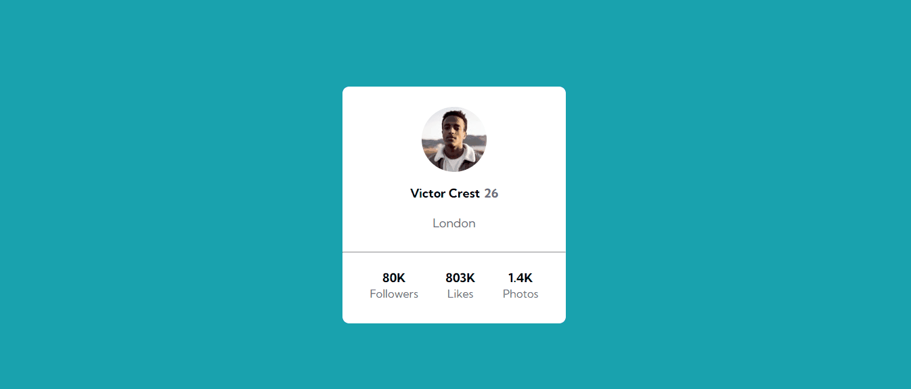
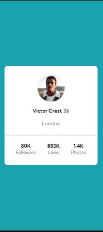

## Table of contents

- [Overview](#overview)
- [Tecnologias usadas](#tecnologias-usadas)
- [Screenshots](#screenshots)
- [Link](#link)
- [Processo](#processo)

## Overview

Layout de página única: cartão com foto e informações de perfil.

## Tecnologias usadas

### Screenshots

#### Desktop Preview

#### Mobile design

### Link

- Live Site URL: <a href="https://als-samara.github.io/profile-card/" target="_blank">Profile Card</a>

## Processo

O projeto foi desenvolvido usando tags semânticas do HTML5 e a propriedade Flexbox do CSS3 para facilitar o dimensionamento dos elementos. Não foi necessário o uso de nenhuma Media Query, devido ao tamanho dos elementos, fazendo com que o site seja responsivo e funcione em todos os tamanhos de tela.